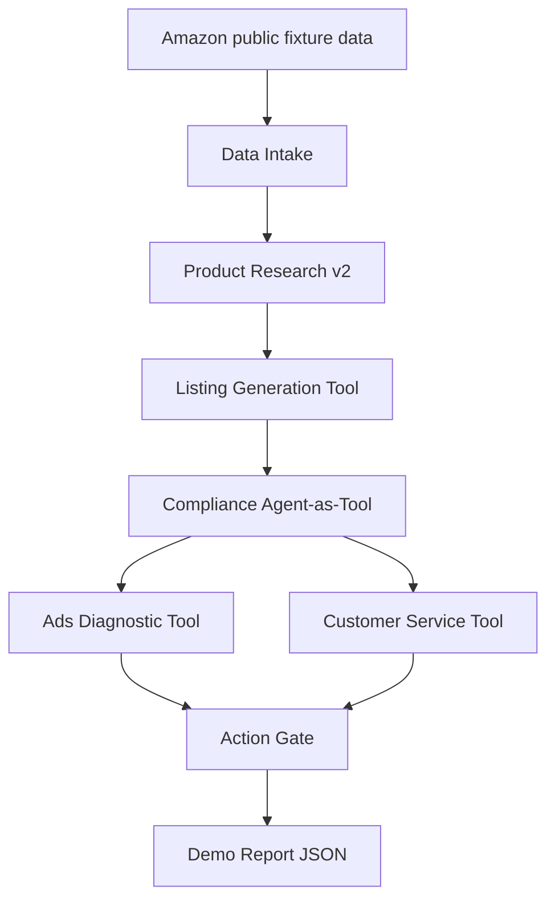

# Cross-Border Agent Demo Walkthrough

This document is the interview/demo guide for the cross-border ecommerce Agent-as-Tool system.

## Quick Run

```bash
.venv/bin/python scripts/demo_crossborder_pipeline.py --pretty
```

Full JSON report:

```text
examples/crossborder/demo_pipeline_result.json
```

Offline-friendly mode:

```bash
.venv/bin/python scripts/demo_crossborder_pipeline.py --pretty --no-compliance
```

Inspect one stage:

```bash
.venv/bin/python scripts/demo_crossborder_pipeline.py --stage ads_diagnostic
```

## Demo Flow



## What The Demo Proves

The demo is not a fake single prompt. It is a controlled workflow:

```text
Agent generates/judges/diagnoses.
Tools calculate and transform facts.
Workflow and Action Gate control execution risk.
```

Expected final summary:

```json
{
  "product_research_decision": "pass",
  "listing_compliance_decision": "pass",
  "ads_decision": "requires_human_review",
  "customer_service_decision": "requires_human_review",
  "ready_for_publish": true,
  "human_review_required": true
}
```

Interpretation:

```text
The product and listing can move toward publish readiness.
Advertising and customer-service actions contain operational risk.
Action Gate blocks or routes those actions to human review.
```

## Stages

| Stage | Input | Output | Why It Exists |
|---|---|---|---|
| Data Intake | Amazon Reviews 2023-style JSONL | ProductResearchRequest | Converts public data into structured ecommerce signals |
| Product Research | competitors, pain points, cost, logistics, compliance precheck | opportunity score | Decides whether a candidate is worth continuing |
| Listing Generation | product brief, keyword hints | title, bullets, description, search terms | Produces marketplace-ready listing copy |
| Compliance Check | listing, product claims | pass/revision/human/block | Prevents unsafe claims from reaching publish flow |
| Ads Diagnostic | impressions, clicks, spend, sales, orders | metrics, issues, suggested actions | Explains why ads are underperforming |
| Customer Service | buyer message, order context | intent, draft reply, suggested actions | Drafts replies without executing risky customer actions |
| Action Gate | proposed actions | allowed/human/block | Separates Agent advice from execution permission |

## API Contracts

| Capability | HTTP Endpoint | Main Output |
|---|---|---|
| Product research | `POST /tools/crossborder/product-research` | `decision`, `score`, `score_breakdown`, `issues` |
| Listing draft | `POST /tools/crossborder/generate-listing` | `listing`, `issues`, `audit.listing_id` |
| Full listing workflow | `POST /tools/crossborder/listing-workflow` | `status`, `listing_package`, `compliance`, `stage_results` |
| Compliance check | `POST /tools/compliance/check` | `decision`, `risk_level`, `issues`, `suggested_rewrite` |
| Ads diagnose | `POST /tools/crossborder/ads/diagnose` | `metrics`, `issues`, `suggested_actions`, `gated_actions` |
| Customer service | `POST /tools/crossborder/customer-service/respond` | `intent`, `draft_reply`, `gated_actions` |
| Action gate | `POST /tools/crossborder/action-gate` | `decision`, `allowed`, `reasons` |

## MCP Tools

| MCP Tool | Purpose |
|---|---|
| `crossborder_product_research` | Score a candidate product |
| `crossborder_generate_listing_draft` | Generate listing copy |
| `crossborder_generate_listing` | Run listing workflow with compliance |
| `compliance_check` | General compliance tool |
| `compliance_check_ad` | Ad/listing compliance check |
| `compliance_check_listing` | Listing compliance check |
| `compliance_verify_certificate` | Certificate/license verification |
| `crossborder_ads_diagnose` | Diagnose ads and gate suggested actions |
| `crossborder_customer_service_respond` | Draft buyer reply and gate risky actions |
| `crossborder_action_gate` | Gate any proposed high-risk action |

## Audit Summary

The demo report includes:

```json
{
  "audit_summary": {
    "research_id": "...",
    "listing_id": "...",
    "compliance_check_id": "...",
    "ads_diagnostic_id": "...",
    "customer_response_id": "...",
    "gate_ids": []
  }
}
```

This makes the workflow explainable and traceable.

## Validation

Current verification command:

```bash
.venv/bin/python -m compileall src/crossborder src/core src/web src/mcp_server.py scripts/demo_crossborder_pipeline.py
.venv/bin/python -m unittest tests.crossborder.test_workflow tests.crossborder.test_data_intake tests.crossborder.test_ads_and_gate tests.crossborder.test_customer_service tests.crossborder.test_demo_pipeline
.venv/bin/python scripts/demo_crossborder_pipeline.py --pretty
```

Current coverage:

```text
26 crossborder tests pass.
The end-to-end demo writes examples/crossborder/demo_pipeline_result.json.
The report contains data_intake, product_research, listing_generation, compliance_check, ads_diagnostic, customer_service, gate_summary, audit_summary, and final_summary.
```

## Production Boundaries

This demo intentionally does not:

```text
Publish listings
Change prices
Pause campaigns
Refund buyers
Submit appeals
Promise delivery dates
```

Those actions must go through Action Gate and external workflow approval.
